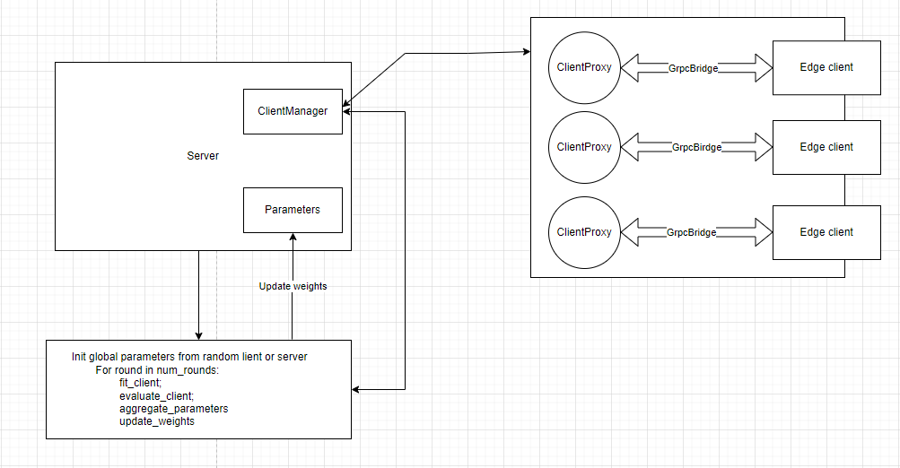

# Federated learning server with gRPC

## Core module

- Server
- ClientProxy
- ClientManager
- GrpcBridge
- Strategy

## Architecture


## Class Server

Main flow của hệ thống gồm:

- Global parameters
- Client manager
- Strategy - Các thuật toán federated: FedAvg, FedMedian, FedSGD,...

-> Thực hiện flow training federated:




## ClientManager

<div style="display:flex;">
    
    <div>
        <p>Quản lý các ClientProxy hiện có trong server</p>
        <ul>
            <li>Khi client join sẽ register với client manager</li>
            <li>Sử dụng cơ chế threading condition của python để thực hiện đợi đủ số lượng client tham gia rồi mới thực hiện các hành động tiếp (Ví dụ trong việc đợi đủ client join training,... )</li>
        </ul>
    </div>
</div>

## ClientProxy

<div style="display:flex;">
    
    <p>
    Định danh và lưu trữ local parameters cho edge client trên server. Thực hiện gửi request và nhận response parameters từ phía edge client qua giao thưc gprc. Việc thực hiện dựa trên cơ chế threading condition, quản lý bởi GrpcBridge
    </p>
</div>

## GrpcBridge

<div style="display:flex;">
    
    <p>
    Cầu nối trao đổi dữ liệu giữa ClientProxy (grpc Service) và EdgeClient (grpc Client). Gửi request lấy parameters từ quá trình training của EdgeClient, đợi phản hồi, đợi hết round và request lấy parameters cho lần training tiếp theo.
    </p>
</div>

## Strategy

Các setting cho quá trình training bao gồm:

- Số lượng tôi thiểu client có mặt để training
- Số lượng tổi thiểu client tham gia training
- Phần trăm số lượng client tham gia training được training
- Hàm evaluate cho các bài toán khác nhau của server

Stategy bao gồm các thuật toán cơ sở cho federated như việc tính toán weights dùng FedAvg hay FedMedian. Dùng gradient như FedSGD

### Các thuật toán Federated đã implement

#### 1. FedAvg

- Tính toán weights trung bình có sử dụng số lượng samples của client

```python
def aggregate(results: List[Tuple[NDArrays, int]]) -> NDArrays:
    """Compute weighted average"""
    # Calculate the total number of examples used during training
    num_examples_total = sum([num_examples for _, num_examples in results])
    
    
    # Create a list of weights, each multipled by the related number of examples
    weighted_weights = [
        [layer * num_examples for layer in weights] for weights, num_examples in results
    ] 
    
    # COmpute average weights of each layer
    weights_prime: NDArrays = [
        reduce(np.add, layer_updates) / num_examples_total
        for layer_updates in zip(*weighted_weights)
    ]
    return weights_prime
```

#### 2. FedMedian (Đang sử dụng cho braintumor)

- Tính toán weights trung bình không sử dụng số lượng samples của client

```python
def aggregate_median(results: List[NDArrays]) -> NDArrays:
    """Compute median."""
    
    # Compute median weight of each layer
    median_w: NDArrays = [
        np.median(np.asarray(layer), axis=0) for layer in zip(*results)
    ]
    return median_w
```

## Merge repo khac vào repo đã có giữ nguyên history

- Bước 1: Clone project Demo_v1_ISOFH từ GitLab:

```cmd
git clone <url_to_Demo_v1_ISOFH_repository>
cd Demo_v1_ISOFH
```

- Bước 2: Thêm remote repository của project grpc:

```cmd
git remote add grpc <url_to_grpc_repository>

```

- Bước 3: Merge project grpc vào trong dự án Demo_v1_ISOFH:

```cmd
git fetch grpc
git merge grpc/master --allow-unrelated-histories

```

Lưu ý rằng --allow-unrelated-histories được sử dụng để cho phép hợp nhất lịch sử không liên quan từ hai repository khác nhau.

- Bước 4: Giải quyết xung đột (nếu có):

Khi bạn merge hai dự án có lịch sử không liên quan, xung đột có thể xảy ra. Bạn cần giải quyết xung đột này bằng cách chọn những thay đổi bạn muốn giữ lại và loại bỏ những thay đổi không cần thiết.

- Bước 5: Commit và push thay đổi:

```cmd
git commit -m "Merge grpc project into Demo_v1_ISOFH"
git push origin master

```
